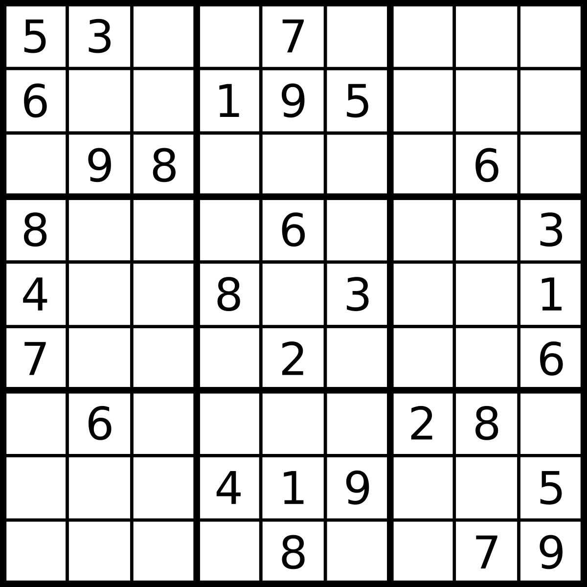

Programmer: Jack Toke
Github link: 

#Sudoku Master


#Installation
- Clone the repo

- CD into the directory
- Run the build shell
- Run the following command

##Introduction
Sudoku is a number puzzle.  According the best source of knowledge, *"Wikipedia"*, it was first appeared in a French newspaper in 1979.

But it only became mainstream in 1986 by the Japanese puzzle company Nikoli, under the name, Sudoku, meaning **"single number"**.

The puzzle has **9x9** grid with digits so that each column, each row and each of the 9 3x3 subgrids that compose the grid contains all the number from 1 to 9.  The setter provides a partially completed grid, which has only one solution.

#Objective of Sudoku Master

I've setout to write a simple app to solve any sudoku.  But later on added the feature to let user to play it as well.  The algorithm is far from being completed, but I've taken the first step in making it.

##Strategies
I have identified two strategies to solve the puzzle.
###Strategy #1
Develop list of possible values for each of the cell.  Go through each cell and then shed those list off as you find the number is already exist in the row, column or subgrid.
For easy sudoku this algorithm is sufficient to solve the puzzle. However, for a more difficult puzzle, another strategy is needed to solve the problem.
**Building a list of potential values**
```
#build the possible values of each cell
def build_potential_value_list(cells)
  cells.each do |row|
    row.each do |cell|
      #all cell except the fixed one
      if !cell.is_fixed
        cell.potential_value_stack = [1, 2, 3, 4, 5, 6, 7, 8, 9]
        
        #for each cell in the vertical
        cell.vertical_family.each do |c|
          cell.potential_value_stack.delete_if {|value| value == cells[c[0]][c[1]].value}
        end
        cell.horizontal_family.each do |c|
          cell.potential_value_stack.delete_if {|value| value == cells[c[0]][c[1]].value}
        end
        cell.block_family.each do |c|
          cell.potential_value_stack.delete_if {|value| value == cells[c[0]][c[1]].value}
        end
      end
    end
  end
end
```
**Shed off the numbers that area already on the grid**
```#shed 
def shed_potential_value_list(cells)
  cells.each do |row|
    row.each do |cell|
      #all cell except the fixed one
      if !cell.is_fixed  #fixed cells are provided by the game setter
        #for each cell in the vertical
        cell.vertical_family.each do |c|
          cell.potential_value_stack.delete_if {|value| value == cells[c[0]][c[1]].value}
        end
        cell.horizontal_family.each do |c|
          cell.potential_value_stack.delete_if {|value| value == cells[c[0]][c[1]].value}
        end
        cell.block_family.each do |c|
          cell.potential_value_stack.delete_if {|value| value == cells[c[0]][c[1]].value}
        end
      end
    end
  end
end
```
**Once cells are shed the cells must be updated to reflect the change**
```
#evaluate and update
#for every cell that only have one potential value
#give the cell the value
def update_cells(cells)
  cells.each do |row|
    row.each do |cell|
      #all cell except the fixed one
      if (!cell.is_fixed) && cell.potential_value_stack.size == 1
        cell.value = cell.potential_value_stack.pop
      end
    end
  end
end
```
###Strategy #2
In order to solve a more advanced puzzle, the program will need to find two/three cells in the same row, column or subgrid that has the same potential values.  If such cells are found, all other cells in the same row, column or subgrid can remove those values in their potential values lists.
```
#Look for two or three cells in the same row, column or subgrid
#that have exactly the same values in their potential value lists
#if such cells are found, remove those values in all other cells 
#that are not one of those cells
def double_or_triple_whammer(sudoku_cells)
  #1. obtain the lists of cells that still need a value
  #2. for each cell in the list look for other cells
  #   which are in the same row, column or subgrid
  #   that has the same potential values
  #3. if such cells are found, remove from other 
  #   cells all those values from them
end
```
###Strategy 3
If a number already appears on two sub-grids on the same row or column, then that number will appear on the remaining row/column that doesn't have the number, provided that the number is in the potential value list of a remaining cell but not the other or it's the only available slot.

#UI Design
##Key Features
#


#Conclusion
The current version of the program can only solve easy Sudoku.  When strategy 2 is implemented I believe it could solve more sudoku.

##Future Improvement
Once strategy 2 is implemented, I could give user the option to choose the level of difficulty.


